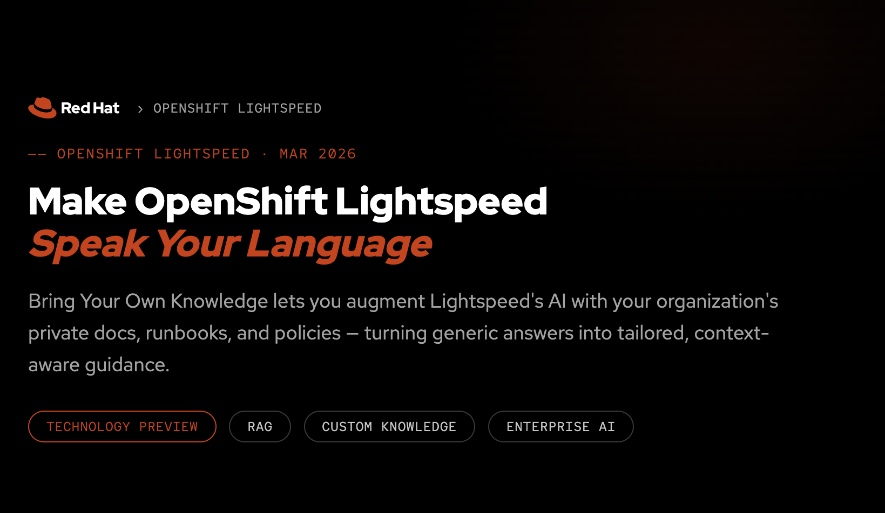

# OpenShift Lightspeed — Bring Your Own Knowledge (BYOK) Demo

> **Watch the full demo recording:** [OpenShift Lightspeed BYOK Demo on YouTube](https://youtu.be/6qsPPp7Pn0s?si=KRB_nXoi2w8ijXCq)



This repository contains everything needed to demonstrate how to augment [OpenShift Lightspeed](https://www.redhat.com/en/technologies/cloud-computing/openshift/lightspeed) with your organization's private documentation using Retrieval-Augmented Generation (RAG). By ingesting custom Markdown files, Lightspeed can answer questions grounded in your internal standards, policies, and runbooks instead of relying solely on public knowledge.

The demo uses a fictional **Bowland Widget Factory** and its OpenShift platform standards as the sample knowledge base.

## Repository Structure

```
.
├── BowlandWidgetFactoryOCPStandards/       # Sample Markdown knowledge base
│   ├── bowland-configmap-secret-standards.md
│   ├── bowland-deployment-standards.md
│   ├── bowland-global-metadata-standards.md
│   ├── bowland-network-policy-standards.md
│   ├── bowland-observability-promql-standards.md
│   └── bowland-service-route-standards.md
├── demo.env.example                        # Environment variable template
├── sync-to-remote.sh                       # Syncs .md files & scripts to a remote RHEL 9 server
├── remote-dnf.sh                           # Installs podman & tree on the remote RHEL 9 server
├── patch-olsconfig-rag.sh                  # Adds RAG config to OLSConfig (zsh)
├── patch-olsconfig-rag-bash.sh             # Adds RAG config to OLSConfig (bash, for remote use)
├── unpatch-olsconfig-rag.sh                # Removes RAG config from OLSConfig
├── openshift-lightspeed-route.yaml         # Route manifest to expose the Lightspeed API
├── DemoSteps.md                            # Step-by-step demo walkthrough
├── podman-commands.md                      # Podman commands reference
├── podman-command.txt                      # Quick-reference podman run command
├── olsconfig-rag-snippet.md                # YAML snippet for manual OLSConfig editing
├── olsconfig-rag-snippet.txt               # Plain-text version of the RAG snippet
├── openshift-lightspeed-byok.html          # HTML slide deck for the presentation
├── docs/openshift-lightspeed-byok-video.html  # Video-embedded version of the deck
└── build_deck.py                           # Generates a .pptx version of the slide deck
```

## Prerequisites

- **RHEL 9 server** — used to run the RAG tool container (provision via [Red Hat Demo Platform](https://catalog.demo.redhat.com))
- **OpenShift cluster with Lightspeed installed** — provision via [Red Hat Demo Platform](https://catalog.demo.redhat.com)
- **Podman** — installed on the RHEL 9 server (use `remote-dnf.sh` to install)
- **oc CLI** — authenticated to your OpenShift cluster
- **Red Hat registry credentials** — to pull the RAG tool image from `registry.redhat.io`
- **SSH access** — key-based authentication to the RHEL 9 server

## Setup

### 1. Configure Environment Variables

Copy the example environment file and fill in your values:

```bash
cp demo.env.example demo.env
```

Edit `demo.env` with your specific settings:

| Variable | Description |
|---|---|
| `REMOTE_USER` | SSH username for the RHEL 9 server |
| `REMOTE_HOST` | Hostname of the RHEL 9 server |
| `LOCAL_SOURCE_NAME` | Local directory containing the Markdown knowledge base (default: `BowlandWidgetFactoryOCPStandards`) |
| `REMOTE_SOURCE_NAME` | Remote directory to receive the Markdown files and scripts (default: `LightspeedBYOKDemo`) |
| `REMOTE_SOURCE_TARGET` | Remote directory for RAG tool output (default: `LightspeedBYOKOutput`) |
| `OCP_REGISTRY_URL` | OpenShift internal image registry route |
| `OLS_NAMESPACE` | Namespace where Lightspeed is installed (typically `openshift-lightspeed`) |
| `RAG_INDEX_ID` | Vector DB index identifier (default: `vector_db_index`) |
| `RAG_INDEX_PATH` | Path to the vector DB inside the container (default: `/rag/vector_db`) |
| `MARKDOWN_SOURCE_DIR` | Absolute path on the remote server to the Markdown files |
| `OUTPUT_DIR` | Absolute path on the remote server for RAG tool output |

### 2. Install Prerequisites on the RHEL 9 Server

Run the remote dnf script to install `podman` and `tree` on the RHEL 9 server:

```bash
./remote-dnf.sh
```

### 3. Sync Knowledge Files to the RHEL 9 Server

```bash
./sync-to-remote.sh
```

This copies all `.md` files from `BowlandWidgetFactoryOCPStandards/` and the bash-compatible patch script (`patch-olsconfig-rag-bash.sh`) to the remote server. It also creates the required remote directories if they don't already exist.

## Running the Demo

### 4. Build the RAG Image on the RHEL 9 Server

SSH into the RHEL 9 server and authenticate to the Red Hat registry:

```bash
podman login -u <REGISTRY_USERNAME> registry.redhat.io
```

Run the RAG tool to process the Markdown files into a vector index and container image:

```bash
podman run -it --rm --device=/dev/fuse \
  -v $XDG_RUNTIME_DIR/containers/auth.json:/run/user/0/containers/auth.json:Z \
  -v <MARKDOWN_SOURCE_DIR>:/markdown:Z \
  -v <OUTPUT_DIR>:/output:Z \
  registry.redhat.io/openshift-lightspeed-tech-preview/lightspeed-rag-tool-rhel9:latest
```

### 5. Push the Image to the OpenShift Registry

Still on the RHEL 9 server, load and push the resulting image:

```bash
# Load the image from the RAG tool output
podman load -i <OUTPUT_DIR>/byok-image.tar

# Log in to the OpenShift internal registry
oc login --token=<YOUR_TOKEN> --server=<YOUR_API_SERVER>
podman login -u any_username -p $(oc whoami -t) <OCP_REGISTRY_URL>

# Tag and push
podman tag localhost/byok-image:latest <OCP_REGISTRY_URL>/<OLS_NAMESPACE>/byok-image:latest
podman push <OCP_REGISTRY_URL>/<OLS_NAMESPACE>/byok-image:latest
```

Alternatively, you can push to an external registry like Quay.io and make the image public.

### 6. Configure OpenShift Lightspeed

From your local machine (with `oc` authenticated to the cluster), patch the OLSConfig to point Lightspeed at your RAG index:

```bash
./patch-olsconfig-rag.sh
```

This adds the following configuration to the `cluster` OLSConfig resource under `spec.ols`:

```yaml
rag:
  - image: '<OCP_REGISTRY_URL>/<OLS_NAMESPACE>/byok-image:latest'
    indexID: vector_db_index
    indexPath: /rag/vector_db
```

To target a differently named OLSConfig resource:

```bash
./patch-olsconfig-rag.sh <olsconfig-name>
```

> **Note:** A bash-compatible version (`patch-olsconfig-rag-bash.sh`) is also available for running directly on the remote RHEL 9 server where zsh may not be installed. It is automatically synced to the remote host by `sync-to-remote.sh`.

### 7. Test It

Open the OpenShift Console and use the Lightspeed chat interface. Try asking:

- *"What SCCs does the Bowland Widget Factory require?"*
- *"What labels need to be included for the Bowland Widget Factory?"*
- *"Tell me about the network policy standards for the Bowland Widget Factory."*

Lightspeed should now reference the ingested Bowland Widget Factory standards in its responses.

## Cleanup

To remove the RAG configuration from Lightspeed and revert to default behavior:

```bash
./unpatch-olsconfig-rag.sh
```

## Presentation Materials

An HTML slide deck is included at `openshift-lightspeed-byok.html` — open it in a browser to present. A video-embedded version is available at `docs/openshift-lightspeed-byok-video.html`. A Python script (`build_deck.py`) can generate a `.pptx` version if you have a Red Hat PowerPoint template (`redhat_template.pptx`) and the `python-pptx` package installed.

## Additional Documentation

- [DemoSteps.md](DemoSteps.md) — Full step-by-step walkthrough with placeholder references
- [podman-commands.md](podman-commands.md) — Detailed Podman command reference
- [olsconfig-rag-snippet.md](olsconfig-rag-snippet.md) — YAML snippet for manual OLSConfig editing
- [sync-to-remote.md](sync-to-remote.md) — Details on the sync script
- [patch-olsconfig-rag.md](patch-olsconfig-rag.md) — Details on the patch script
- [unpatch-olsconfig-rag.md](unpatch-olsconfig-rag.md) — Details on the unpatch script
